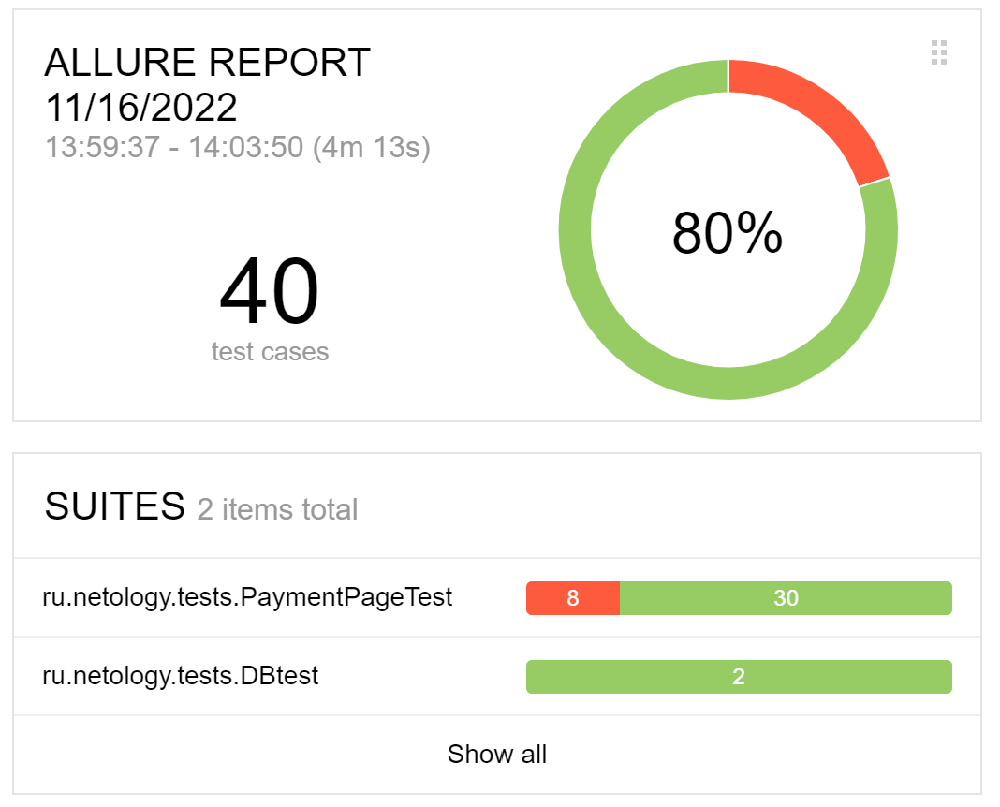

## Отчёт по итогам тестирования
### Краткое описание
* В ходе автоматизации тестирования были реализованы позитивные и негативные сценарии заполнения тестовой страницы

* Реализована поддержка БД - MySQL

**Автоматизация тестирования сервиса "Путешествие дня" выполнялась с использованием следующих инструментов:**

* IntelliJ IDEA Community Edition 2022.2.2
* Java 11
* Docker Desktop
* Браузер Chrome и chromedriver
* Github
* junit-jupiter:5.8.1
* selenide:5.19.0
* allure:2.16.1
* faker 1.0.2
**Для работы с БД и симулятором банковских сервисов использовался docker**

**Были протестированы сценарии:**

1. Успешная покупка с дебетовой и кредитной карты
2. Отказ банка с дебетовой и кредитной картой
3. Негативные проверки полей: невалидные значения, незаполненные поля
4. Проверка записи данных в БД при использовании MySQL

**Количество тестов**

Всего: 40 тестов:
* Успешных: 32 (80%)
* Неуспешных: 8 (20%)

###Общие рекомендации
**Найденные баги**
* Уедомление об оплате тура при воде номера не действительной карты
* Поле "Владелец" принемает заполнение на кирилице
* Поле "Владелец" принемает заполнение имени с спецсимволами
* Поле "Владелец" принемает имя из одной буквы
* Поле месяц принимает значение "00"
* Поле "Владелец" принемает заполнение имени с цифрой
* при вводе месяца одной цифрой нет автодополнения нуля в переди
* В форме "Путешествия дня" отсутствует чекбокс согласия на обработку персональных данных
* двойное уведомление, при оплате картой
* орфографическая ошибки в названии тура

**Рекомендации по улучшению интерфейса**
* Релизовать добавление нуля при заполнение поля месяц одной цифрой
* Во всех случаях, когда поля формы остаются не заполненными, реализовать появление предупреждающей надписи "Поле обязательно для заполнения" вместо "Неверный формат". На данный момент тестирование организовано с учетом имеющихся предупреждающих надписей.
* Возможно, была бы удобной опция сохранять данные в анкете при переключении между функциями "Купить" и "Купить в кредит". Сейчас анкета очищается каждый раз.

